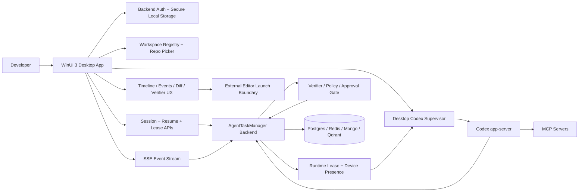

# Codex Desktop Client Architecture

This document defines the Windows-first desktop client for AgentTaskManager's existing backend and harness.

The build target is a WinUI 3 desktop application in `clients/desktop/AgentTaskManager.Desktop`.

The runtime target is Codex app-server with `gpt-5.3-codex` as the default preferred model.

## 1. Executive Architecture Summary

The system has six hard boundaries:

1. `WinUI 3 desktop client`
   Owns local sign-in UX, workspace picking, local secure storage, event rendering, diff review, file-open requests, and local runtime process supervision on the active device.
2. `AgentTaskManager backend`
   Owns canonical session identity, threads, turns, event history, memory links, receipts, verifier results, approved output state, runtime leases, device presence, and remote continuity metadata.
3. `Codex app-server runtime`
   Runs as a supervised process dependency on the runtime-owning device. It is a transport endpoint, not the authority for session history.
4. `MCP server layer`
   Supplies repo inspection, retrieval, filesystem, git, Qdrant-backed memory, and AgentTaskManager first-party tools to the Codex runtime.
5. `Verifier and policy layer`
   Decides whether candidate output is approved, blocked, rewritten, or downgraded. Raw model output is never equivalent to final output.
6. `Workspace and file boundary`
   Every editing-capable chat is pinned to an explicit repo or bounded workspace root. No default whole-PC agent behavior is allowed.

The desktop app is the primary operator surface, but it is still a client. The backend remains the source of truth even when the active device owns the local runtime process.

The desktop MVP is intentionally desktop-only. Existing IDE companion sketches in this repo are out of scope for this build and must not shape the session model.

## 2. Component Diagram



## 3. Session Lifecycle Design

### New chat

1. User signs in to AgentTaskManager from the desktop app.
2. User picks an explicit `workspaceRoot` and `repoPath`, chooses a profile, and starts a new session.
3. Desktop sends `POST /api/codex-client/sessions`.
4. Backend persists:
   - session record
   - workspace binding
   - resolved config snapshot
   - originating device presence
   - initial runtime lease record
5. Backend emits:
   - `SessionCreated`
   - `WorkspaceBound`
   - `SessionAttached`
6. If runtime creation is requested, the active device builds a local runtime launch envelope from backend session detail and starts a supervised Codex app-server process.
7. Once the JSON-RPC channel is healthy, desktop posts the runtime connection snapshot to the backend and the backend emits `RuntimeReconnected`.

### Turn lifecycle

1. Desktop submits `POST /api/codex-client/sessions/{sessionId}/turns`.
2. Backend persists the turn and emits `TurnStarted`.
3. Backend opens receipt and verifier bookkeeping immediately and emits `VerifierStarted`.
4. Runtime-owning desktop sends the turn to Codex app-server over the local JSON-RPC connection.
5. Desktop normalizes runtime notifications and forwards them to the backend ingestion boundary.
6. Backend persists normalized events and replays them to every connected desktop via SSE:
   - `ThreadStarted`
   - `TurnDeltaReceived`
   - `ToolCallRequested`
   - `PatchPublished`
   - `FileFocusRequested`
7. Tool execution receipts are persisted by the backend or trusted tool adapters, never inferred from what the UI happens to display.

### Candidate output, verification, and release

1. Runtime output lands first as `CandidateOutputProduced`.
2. Backend correlates:
   - required receipt kinds
   - verifier evidence
   - policy outcomes
   - patch artifacts
3. Backend decides one of:
   - `ApprovedOutputReleased`
   - `OutputBlocked`
   - `VerifierFailed`
4. Desktop always renders candidate output separately from approved output.
5. The session cannot reach a visually final state until approved output metadata exists.

### Patch and file flow

1. Runtime publishes patch metadata and diff previews through the backend.
2. Desktop shows changed files, diff preview, patch summary, and patch approval state.
3. When runtime requests attention on a file, backend emits `FileFocusRequested`.
4. Desktop can:
   - focus the file inside its own patch/file pane
   - launch the file or repo in an external editor
5. File launch is explicit and deterministic against the bound workspace root.

### Remote resume and multi-device continuity

1. User signs in on a second Windows device.
2. Desktop lists sessions from the backend and attaches in observer mode first.
3. Backend returns:
   - session history
   - recent events
   - current runtime lease owner
   - resumability metadata
   - device presence
4. If the user requests ownership, desktop calls `POST /resume`.
5. Backend updates the runtime lease and emits `SessionResumed`.
6. If the previous device still owns a live runtime, backend marks the lease `HANDOFF_PENDING`.
7. If the runtime is gone, the new device may cold-start a replacement runtime and resume the thread from backend-persisted thread metadata.

### Failure handling

1. If the local runtime disconnects, desktop reports a degraded runtime snapshot and backend emits `RuntimeDisconnected`.
2. Desktop supervisor retries with bounded exponential backoff.
3. Backend event history stays intact during local process failure.
4. SSE reconnect uses the last durable backend event id, not in-memory desktop state.
5. If thread resume fails on a replacement runtime, backend marks the session as recovery-required and blocks output release until the user chooses retry, fork, or observe-only.

## 4. Auth Model

There are two separate auth systems and they must remain separate in code, UI, and storage.

### AgentTaskManager backend auth

- Purpose: authorize the user to our backend APIs and session/event surfaces.
- Storage: local secure storage on Windows for backend access and refresh material plus device registration metadata.
- Scope: session listing, turn submission, event subscription, lease handoff, device presence, verifier history, memory references, and patch artifacts.

### Codex / OpenAI auth

- Purpose: authorize Codex app-server itself with supported OpenAI credentials.
- Supported modes to target:
  - ChatGPT sign-in
  - API key sign-in
  - runtime account snapshots that expose ChatGPT-linked auth tokens or account state
- Desktop may host the login UX and read runtime account state, but it must not fabricate OpenAI credentials.

This is not a billing or entitlement bypass:

- Codex still requires supported OpenAI auth.
- Rate limits and plan entitlements still come from OpenAI.
- Our backend only adds continuity, policy, verification, and session coordination around a supported runtime.

Exact uncertainty:

- Official OpenAI help content confirms ChatGPT sign-in, API-key-backed access, and Windows availability for Codex as of March 22, 2026.
- Official OpenAI API model docs also list `gpt-5.3-codex` as an available coding model as of March 22, 2026, while the current Codex help article says CLI and IDE defaults depend on client version and references the GPT-5.1 Codex family.
- The installed Codex app-server build was validated locally on March 22, 2026 by generating its JSON schema and verifying support for `--listen ws://127.0.0.1:PORT`, `--session-source`, `initialize`, `initialized`, `thread/start`, `thread/resume`, and `turn/start`.
- Safest path: keep model choice configurable per session, pin the desktop default to `gpt-5.3-codex` only when the installed app-server build supports it, keep `ICodexRuntimeConnection` and the event mapper versioned behind our own adapter, and persist only normalized backend events as canonical history.

## 5. Data Model and Contracts

### Session APIs

- `POST /api/codex-client/sessions`
- `GET /api/codex-client/sessions`
- `GET /api/codex-client/sessions/{sessionId}`
- `POST /api/codex-client/sessions/{sessionId}/attach`
- `POST /api/codex-client/sessions/{sessionId}/resume`
- `POST /api/codex-client/sessions/{sessionId}/turns`
- `GET /api/codex-client/sessions/{sessionId}/events`
- `GET /api/codex-client/sessions/{sessionId}/events/stream`

### Runtime coordination APIs

- `POST /api/codex-client/sessions/{sessionId}/runtime/connected`
- `POST /api/codex-client/sessions/{sessionId}/runtime/disconnected`
- `POST /api/codex-client/sessions/{sessionId}/runtime/events`

### Auth APIs

- `POST /api/auth/login`
- `POST /api/auth/refresh`
- `POST /api/auth/logout`

### Canonical event names

- `SessionCreated`
- `SessionAttached`
- `SessionResumed`
- `WorkspaceBound`
- `ThreadStarted`
- `TurnStarted`
- `TurnDeltaReceived`
- `ToolCallRequested`
- `ToolReceiptPublished`
- `VerifierStarted`
- `VerifierFailed`
- `VerifierPassed`
- `CandidateOutputProduced`
- `ApprovedOutputReleased`
- `OutputBlocked`
- `PatchPublished`
- `FileFocusRequested`
- `ExternalEditorOpenRequested`
- `RuntimeDisconnected`
- `RuntimeReconnected`
- `SessionCompleted`

### Persistence

Use:

- Postgres for canonical session, turn, event, lease, config snapshot, runtime snapshot, device presence, receipt, verifier, output summary, and patch metadata.
- Mongo for large bodies such as candidate output text, approved output text, patch bodies, and runtime diagnostic payloads.
- Redis for event fan-out cursors, runtime lease heartbeats, reconnect coordination, and short-lived observation state.
- Qdrant for memory and context references linked back into canonical session/turn ids.

The proposed schema lives in `docs/codex-client-platform/codex-session-platform.sql`.

### Config resolution

Every session stores the resolved workspace config snapshot:

- user defaults from the user's Codex config
- project overrides from the selected workspace
- explicit profile choice
- resolved MCP registrations
- workspace-scoped policy values
- approval and sandbox settings
- deterministic working directory

Remote observers read the persisted resolved snapshot, not local ambient config.

## 6. WinUI 3 App Structure

Target project layout:

```text
clients/desktop/
  AgentTaskManager.Desktop.sln
  AgentTaskManager.Desktop/
    App.xaml
    App.xaml.cs
    MainWindow.xaml
    MainWindow.xaml.cs
    Contracts/
      AuthContracts.cs
      RuntimeContracts.cs
      SessionContracts.cs
      SessionEventTypes.cs
    Services/
      BackendAuthService.cs
      CodexRuntimeConnection.cs
      CodexSupervisorService.cs
      DesktopJson.cs
      DesktopStoragePaths.cs
      DesktopServiceContracts.cs
      DevicePresenceService.cs
      DiffNavigationService.cs
      MemoryContextService.cs
      OutputReleaseService.cs
      RemoteSessionResumeService.cs
      RepoLaunchService.cs
      SecureCredentialStorageService.cs
      SessionClientService.cs
      SessionStreamService.cs
      ToolReceiptService.cs
      VerifierStatusService.cs
      WorkspaceRegistryService.cs
    Utility/
      DispatcherQueueExtensions.cs
      ObservableCollectionExtensions.cs
    ViewModels/
      MainShellViewModel.cs
      OutputGateViewModel.cs
      PatchReviewViewModel.cs
      SessionDetailViewModel.cs
      SessionListViewModel.cs
      SignInViewModel.cs
      StatusStripViewModel.cs
      WorkspacePickerViewModel.cs
```

The desktop UI has three columns:

- left rail for sign-in, workspace picking, and recent sessions
- center column for turns, prompt composer, and live event stream
- right column for candidate vs approved output, verifier state, receipts, memory, device presence, patch review, and file focus requests

## 7. Desktop UX Flow

### Sign-in

- User enters backend URL and credentials.
- Desktop stores backend auth secrets locally and restores them on next launch.
- Codex/OpenAI auth is shown separately as runtime account state, not merged into backend login state.

### Repo and workspace selection

- User either chooses a pinned workspace or enters a workspace path directly.
- New sessions default to `REPOSITORY` scope and create a runtime by default.
- Utility sessions are explicit and visibly marked.

### Session work

- Recent sessions load from backend.
- Selecting a session attaches this device as an observer first.
- Resume ownership is explicit and separate from simple observation.

### Turn authoring

- Prompt entry stays in the center composer.
- Turn submission is disabled when the user is signed out or no session is selected.
- Live stream reconnect state is shown in the top status strip.

### Patch review and file opening

- Right pane shows diff previews and changed files.
- File focus requests are selectable and launch into the configured external editor or the default shell handler.
- Candidate output remains clearly marked as provisional until approved output exists.

### Remote continuity

- Device presence and runtime owner are always visible.
- Observer devices can watch progress without stealing the lease.
- Runtime handoff is a separate explicit action.

## 8. Codex Runtime Integration Plan

### Supervisor model

- One local app-server runtime per editing-capable session.
- No pooled editing runtimes in the MVP.
- Utility sessions may share runtime infrastructure later, but not in the initial build.

### Runtime adapter

- `ICodexRuntimeConnection` is a versioned JSON-RPC client abstraction.
- `ICodexSupervisorService` owns local process startup, health, retry, and graceful shutdown policy.
- Desktop converts raw runtime notifications into normalized backend events before they become canonical.
- The current desktop scaffold launches `codex app-server --listen ws://127.0.0.1:{port} --session-source desktop` and connects over loopback WebSocket.
- The verified first-pass method set is:
  - client request: `initialize`
  - client notification: `initialized`
  - client request: `thread/start`
  - client request: `thread/resume`
  - client request: `turn/start`
- The verified first-pass notification mapping is:
  - `thread/started` -> `ThreadStarted`
  - `turn/started` -> `TurnStarted`
  - `turn/diff/updated` -> `PatchPublished`
  - `item/fileChange/outputDelta` -> `PatchPublished`
  - `item/agentMessage/delta` -> `TurnDeltaReceived`
  - `item/completed` -> candidate output or tool receipt, depending on item type

### Startup inputs

Every local runtime envelope must include:

- `sessionId`
- `runtimeId`
- `workspaceRoot`
- `workingDirectory`
- `profileKey`
- `preferredModel`
- `requiredMcpServers`
- `approvalPolicy`
- `sandboxMode`
- config layer snapshot

### Reconnect policy

- immediate reconnect for broken transport with healthy process
- bounded exponential backoff for crashed process
- resume existing thread if the backend still has resumable thread metadata
- mark recovery required if resume fails

### Logging and diagnostics

- desktop writes structured local logs under `%LocalAppData%\AgentTaskManager\Desktop`
- backend stores canonical runtime snapshots and disconnect reasons
- raw runtime payload persistence should be optional and diagnostics-only

## 9. Implementation Plan

### Phase 1: validate the architecture quickly

1. Land the backend schema and DTO contract set.
2. Ship backend session list, create, attach, resume, turn submit, event list, and SSE stream endpoints.
3. Ship the WinUI desktop shell with sign-in, workspace picker, recent sessions, transcript, event stream, candidate vs approved output, patch pane, and file launch actions.
4. Add local secure storage and device registration.

### Phase 2: wire the active-device runtime

1. Implement local runtime lease ownership and heartbeat.
2. Implement local Codex app-server supervisor and JSON-RPC adapter.
3. Normalize runtime notifications into backend event ingestion.
4. Persist runtime snapshots and reconnect metadata.

### Phase 3: harden output control and continuity

1. Complete receipt correlation and verifier visualization.
2. Add explicit handoff flow across devices.
3. Add recovery-required UX for dead runtime replacement.
4. Add detailed diagnostics and support export bundle.

### Fastest validation path

Build the backend session/event protocol and the desktop read-only shell first. It proves sign-in, session continuity, diff visibility, verifier UX, and remote observation before the app-server process bridge is fully wired.

## 10. Initial Scaffolding Strategy

The initial scaffold in this repo should do four things immediately:

1. Define stable C# DTOs for the desktop app that mirror the backend contract instead of inventing view-only objects.
2. Provide explicit desktop services for auth, sessions, SSE event streaming, secure storage, device presence, runtime diagnostics, diff opening, repo opening, memory summary, and output gating.
3. Split the WinUI surface into focused view models instead of a single giant shell object.
4. Keep the runtime adapter versioned behind a safe contract boundary so app-server schema drift stays isolated from the rest of the desktop client.

## 11. Highest-Risk Technical Decisions

### 1. Where runtime ownership lives

Recommendation:

- The backend owns the lease record.
- The active desktop owns the local process.
- Observers never become runtime owners implicitly.

### 2. Per-workspace runtime vs pooled runtime

Recommendation:

- Use one runtime per editing session.
- Only consider pooling for read-only utility sessions later.

### 3. App-server protocol drift

Recommendation:

- Persist normalized backend events, not raw runtime transport payloads.
- Keep a versioned mapper between runtime notifications and backend event types.
- Prefer WebSocket transport for the desktop client because the installed app-server officially supports `ws://IP:PORT`, which removes the need to guess stdio framing details.

### 4. Config reuse vs backend snapshots

Recommendation:

- Reuse Codex-style config layering for ergonomics.
- Persist the resolved snapshot per session so remote continuity does not depend on local machine state.

### 5. Candidate vs approved output

Recommendation:

- Store them separately.
- Show them separately.
- Never render a `done` state in the desktop UI until approved output metadata exists.
